# COSC 560 Programming Assignment 1
## Dakota Sanders & Andrey Karnauch

### Section 1: Installation
To run our HTTP server, install Python 3, which can be found [here](https://www.python.org).

### Section 2: Operation
Once installed, the server can be started by running `[your python installation] router.py`. 
From there, open up a browser and navigate to `localhost:8888`. Our server runs on port 8888.

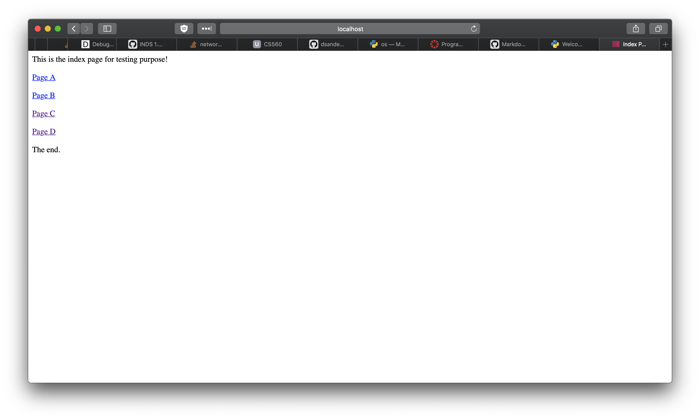

If you see a screen like the provided screenshot, our program is running. Normally a web server is configured to serve content out of a certain directory. We have chosen to configure ours to serve from the `site/` directory in our repository.

**NOTE:** Our code has only been tested on Safari, Firefox and Google Chrome. Due to some recent updates to Safari's security policies and the strict enforcement of HTTPS, file and survey uploads do not work on Safari, and will cause problems. Do not upload files or do the survey on Safari. The reason for this is because Safari sends empty `POST` request bodies if the connection is not secure. We have not tried Edge or Internet Explorer, as we do not have computers capable of running these browsers.

Page A and page B demonstrate our ability to handle basic `GET` requests. Page C and page D demonstrate our ability to handle form data via `POST` requests, both `application/x-www-form-urlencoded` and `multipart/form-data`. There are also links to the directory listing page and file uploads page.

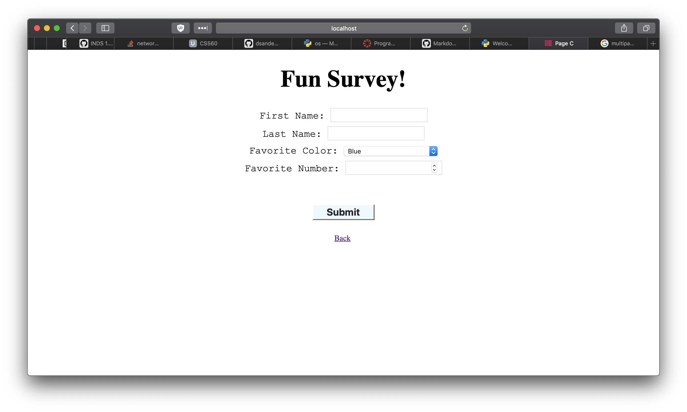

Page C allows the user to fill out a survey asking basic user information. Upon submitting, the site sends a `application/x-www-form-urlencoded POST` request to our server, which handles the data and stores it in a text file inside of `data/survey_log.txt` in the repository.

Page D allows the user to upload a file, which sends a `multipart/form-data` request to the server. To assist grading, we store the file in `uploads/` in the repository to be accessed as needed.
**NOTE:** We make no guarantees as to the speed of the upload process. This may take quite a while, especially for large files. We do not implement a loading screen, but you may find that your browser indicates the progress of the upload.

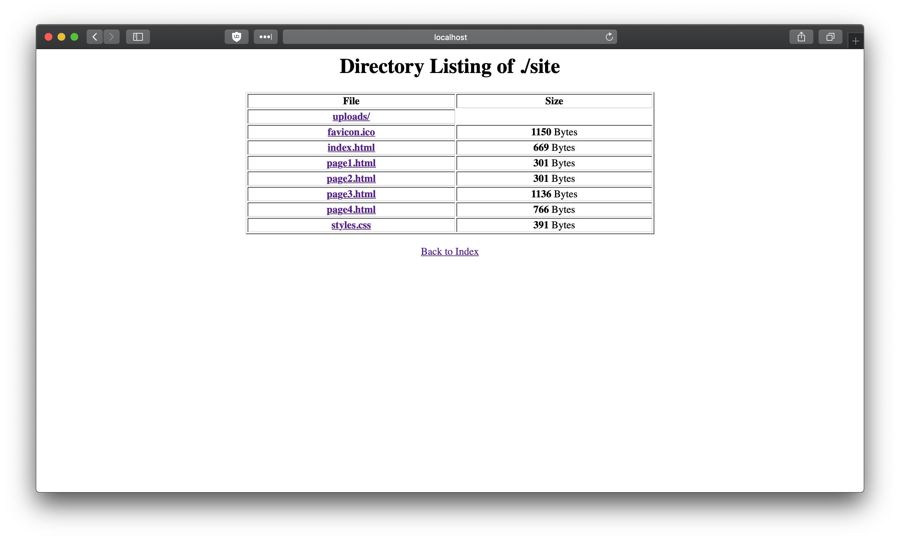

The directory listing page shows all available pages within the `site/` subdirectory of our repository. It also shows the file sizes. These are clickable links, which will direct you to the file or directory you choose.

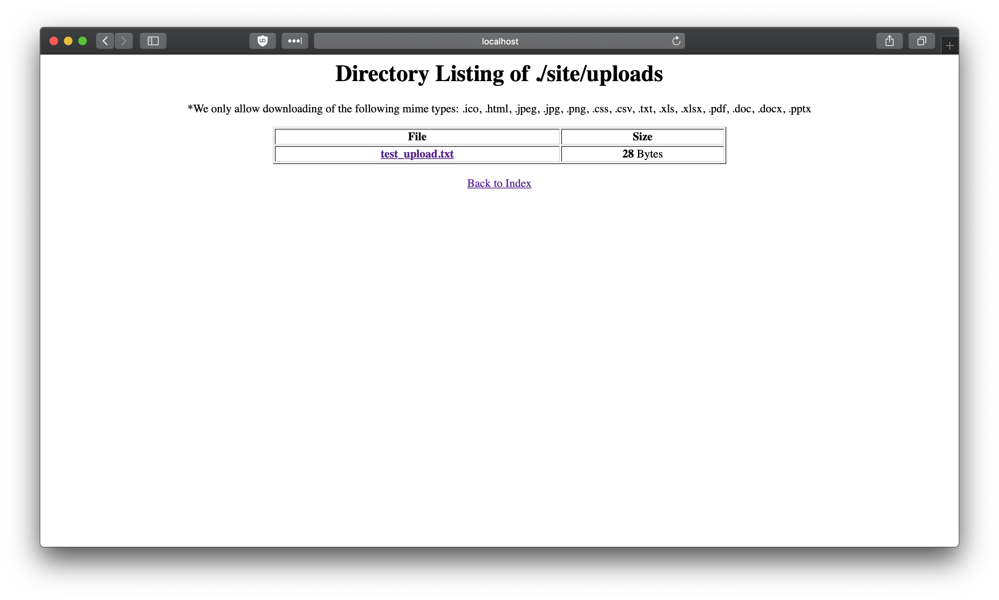

The file upload page allows you to see all files uploaded from Page D. To simplify this process for the sake of this project, we only allow a limited number of file extensions to be redownloaded, which are listed at the top of the page. To view the file, simply click on the link provided. **NOTE:** The server does support any type of file upload, just not redownload.

### Section 3: Code Structure
To assist in grading, we will lay out a basic overview of the structure of our code.

`router.py` is our direct server code. It opens a socket and connects on port 8888. Once it receives a connection, it spawns a new helper thread to handle the request. This allows `router` to be as available as possible to handle new requests.

These helper threads instantiate an object of type `RequestParser`, which can parse the request for important information. It then instantiates a `Responder` object, which uses that information to send a correct HTTP response to the user.

### Section 4: Testing
#### Step 1: Index
When you access `localhost:8888` you will be routed to `index.html`.

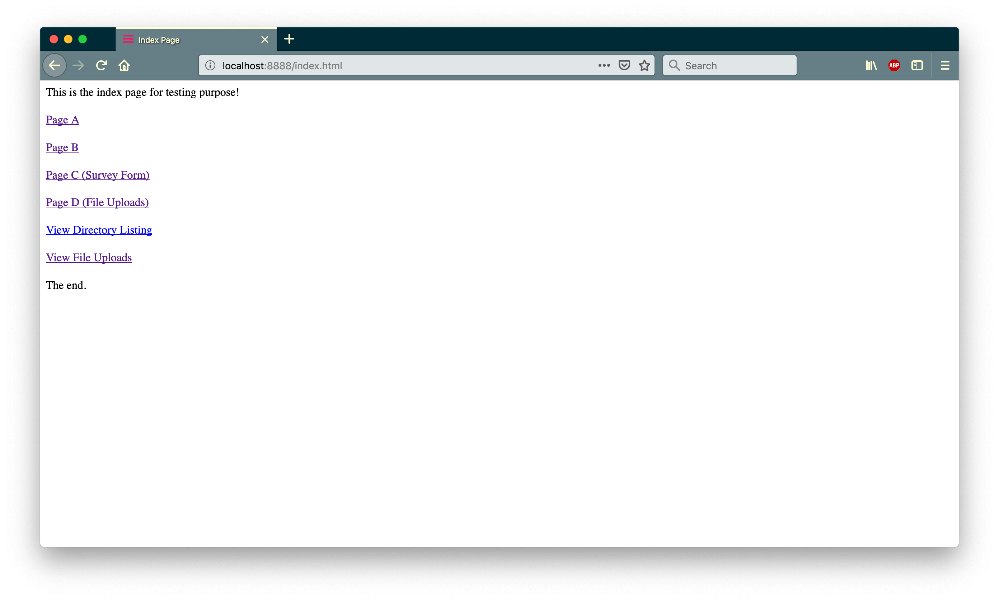

#### Step 2: Page A
If you click `Page A`, you will be routed to a basic html page.

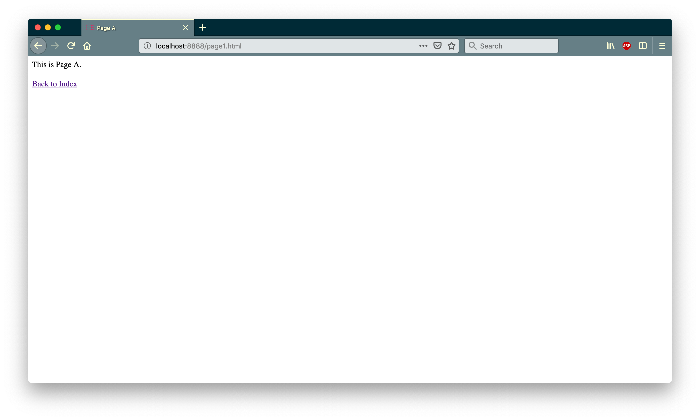

#### Step 3: Page B
If you click `Page B`, you will be routed to a very similar basic html page.

#### Step 4: Page C
If you click `Page C`, you will be routed to the "Fun Survey!" page, where you can enter form data that will be submitted as an `application/x-www-form-urlencoded` POST request to the server. You can check the results of this request by looking at `data/survey_log.txt`.

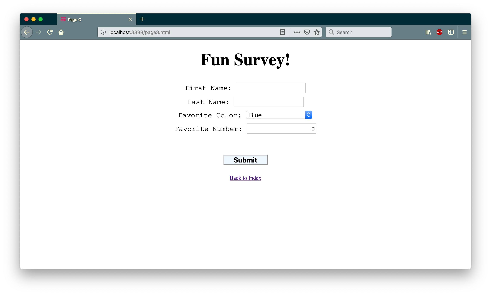

#### Step 5: Page D
If you click `Page D`, you will be routed to the "Upload Here!" page, where you can submit a file that will be submitted as a `multipart/form-data POST` request to the server.

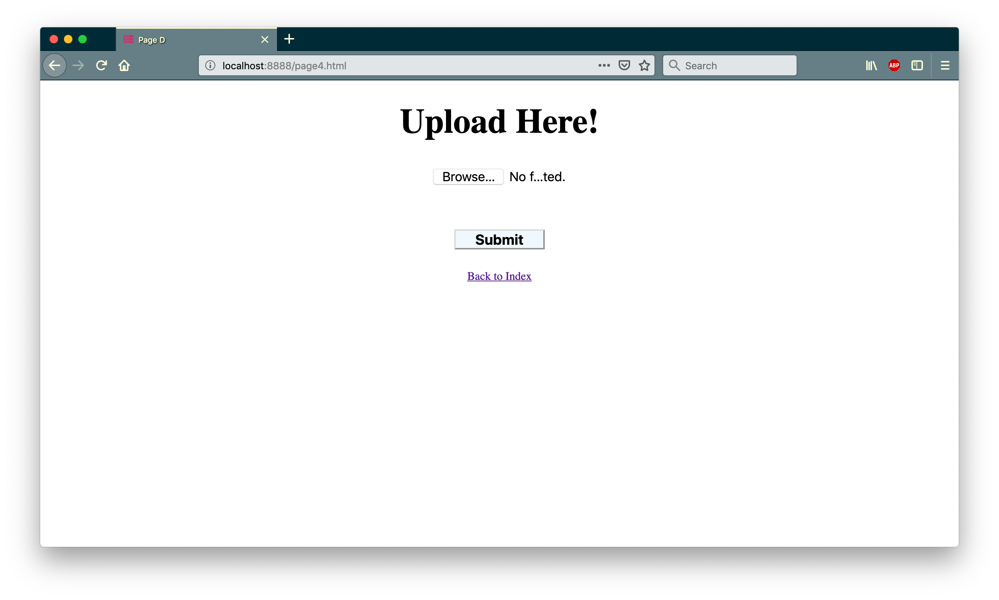

#### Step 6: Directory Listing
If you click `View Directory Listing`, you will be navigated to the listing of `./site`. Here you will find links to the other files in the directory, as well as links to see subdirectories. Here you will also see the file size of the files.

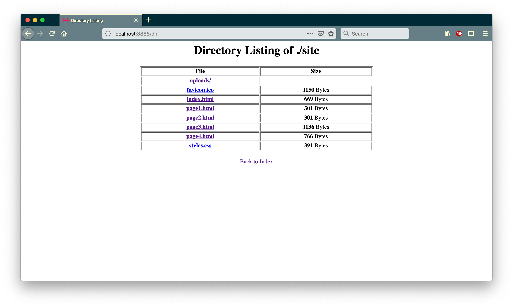

#### Step 7: File Uploads
If you click `View File Uploads`, you will be navigated to a listing of all uploaded files from page D. Here you will also see the file size of the files. If the file extension matches those listed at the top of this page, you can click on the link and download the file again.

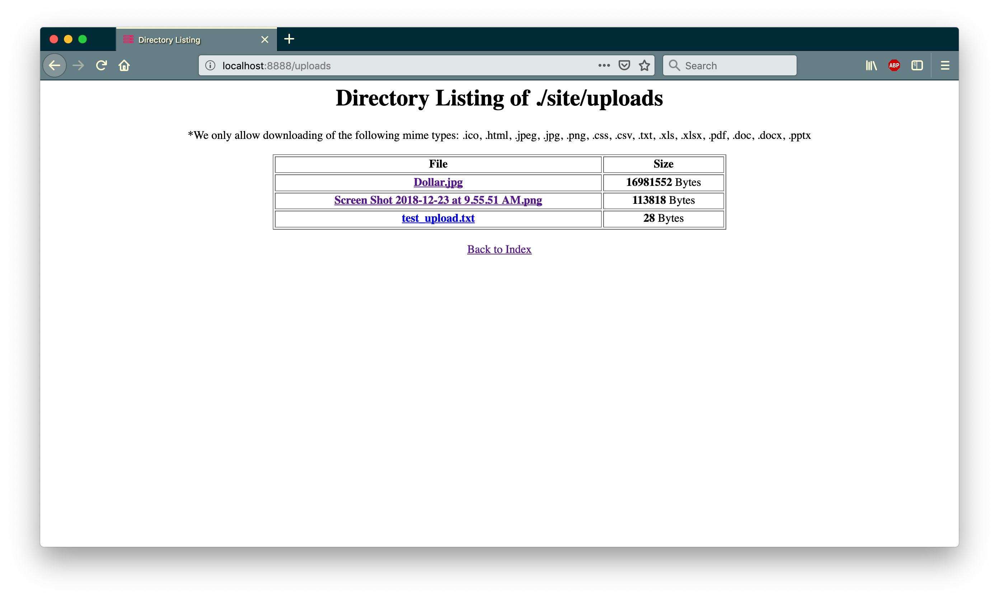

### Section 5: Results
To test our results, we have attempted numerous times to demonstrate `GET`, `POST`, and `multipart/form-data` requests. We have built in this functionality to the site presented by the webserver. We have linked CSS files to our HTML and seen the changes take place, which gives us confidence our server runs as intended.

When the survey page sends a `POST` request, we store that form data in a file called `data/survey_log.txt`.

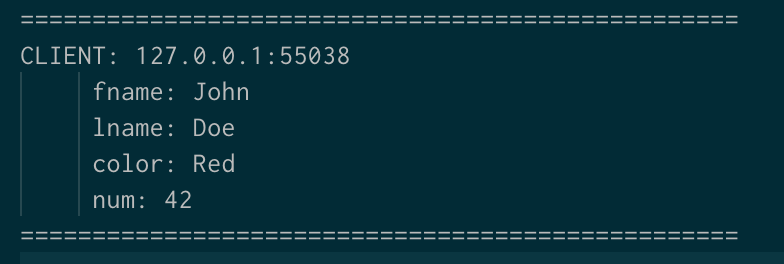

We have also tested using `wget` and `curl`, and while we could not get `curl` to handle `POST` requests due to the way we open connections, we do have several working examples of `wget` calls.

#### Example 1: `GET` `styles.css`

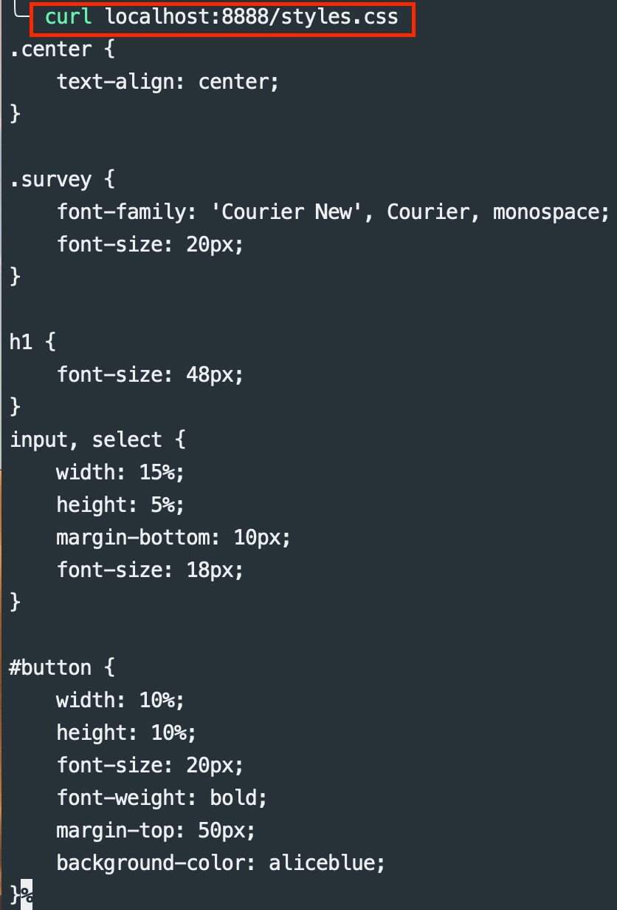

#### Example 2: `GET test_upload.txt`

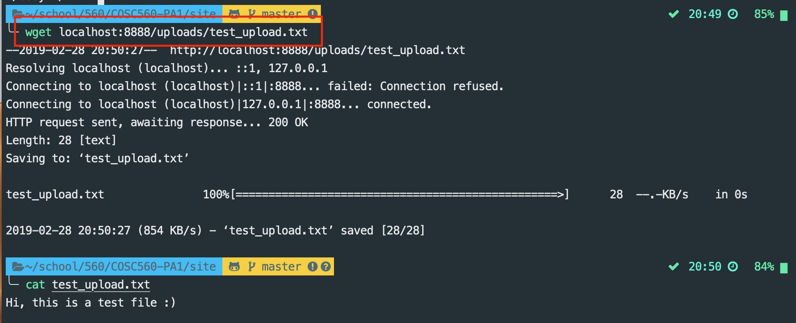

#### Example 3: `GET page1.html`

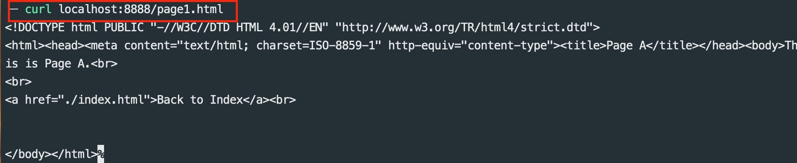

Based on our testing, our webserver is capable of fielding `GET`, `POST`, and `multipart/form-data` requests, providing data based on those requests, and sending responses modern browsers are capable of understanding. We support directory listing, file uploads, form data uploads, file redownloads, page navigation, and HTTP header parsing.